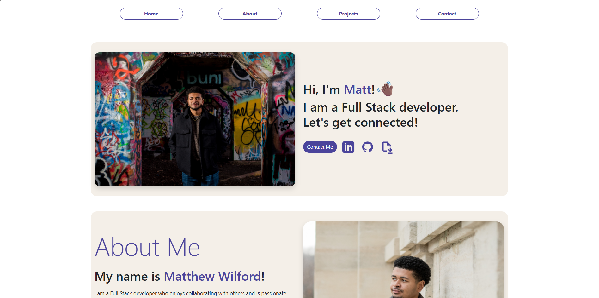

# Welcome to My Portfolio Site



## Overview

This portfolio showcases my work as a **Full Stack Developer**, highlighting projects that combine creativity, functionality, and clean design.
It reflects my passion for building responsive, user-friendly applications and collaborating on innovative solutions.

## Live Demo

👉 [View the site here](https://matthew-wilford.github.io/portfolio/)

## Tech Stack

- **Frontend:** React, Bootstrap, CSS, SASS
- **Backend:** Node.js
- **Form Handling:** Formspree

## Getting Started

To run this project locally:

```bash
# Clone the repository
git clone https://github.com/matthew-wilford/portfolio.git

# Navigate into the project directory
cd portfolio

# Install dependencies
npm install

# Start the development server
npm start
```

## Contact

If you have questions about this project or would like to get in touch, please use the Contact section on my portfolio site.

## License

This project is licensed under the MIT License, a permissive, free‑use license that allows you to use, modify, and distribute the code with proper attribution.
